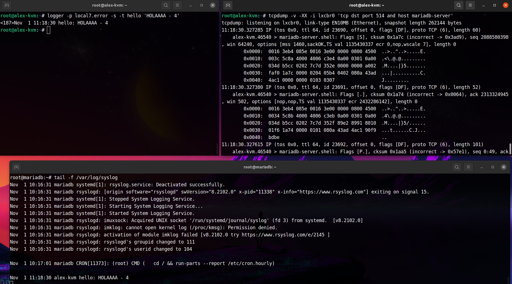

# Rsyslog to lxc container over tcp

### Create compatible table
createDB.SQL

```sh
## ----- mariadb container
apt install -y rsyslog-mysql rsyslog-relp

vim /etc/rsyslog.conf
```
    #################
    #### MODULES ####
    #################

    module(load="imuxsock") # provides support for local system logging
    module(load="immark")  # provides --MARK-- message capability

    # provides UDP syslog reception
    #module(load="imudp")
    #input(type="imudp" port="514")

    # provides TCP syslog reception
    module(load="imtcp")
    input(type="imtcp" port="514")

    # provides kernel logging support and enable non-kernel klog messages
    module(load="imklog" permitnonkernelfacility="on")

    module(load="imrelp")
    input(type="imrelp" port="5000" maxDataSize="10k" )

```sh
systemctl restart rsyslog
tail -f /var/log/syslog 
```

```sh
## ----- kvm host
echo "10.0.3.77  mariadb-server" >> /etc/hosts

vim "/etc/rsyslog.d/50-default.conf"
    local7.*        -/var/log/local7.log
    #local7.*       :omrelp:mariadb-server:5000
    local7.*        @@mariadb-server:514


systemctl restart rsyslog
logger -p local7.error -s -t hello 'HOLAAAA'

```

To monitor traffic on lxc network
`tcpdump -v -XX -i lxcbr0 dst port (514 or 5000) and host mariadb-server`




### Redirect apache2 logs to mariadb server through rsyslog

```
vim /etc/apache2/sites-enabled/000-default.conf
    ErrorLog    "|/usr/bin/tee -a ${APACHE_LOG_DIR}/error.log  |/usr/bin/logger -thttpd -plocal7.err"
    # CustomLog "|/usr/bin/tee -a ${APACHE_LOG_DIR}/access.log |/usr/bin/logger -thttpd -plocal7.notice" combined
```

- https://httpd.apache.org/docs/2.4/logs.html#piped


